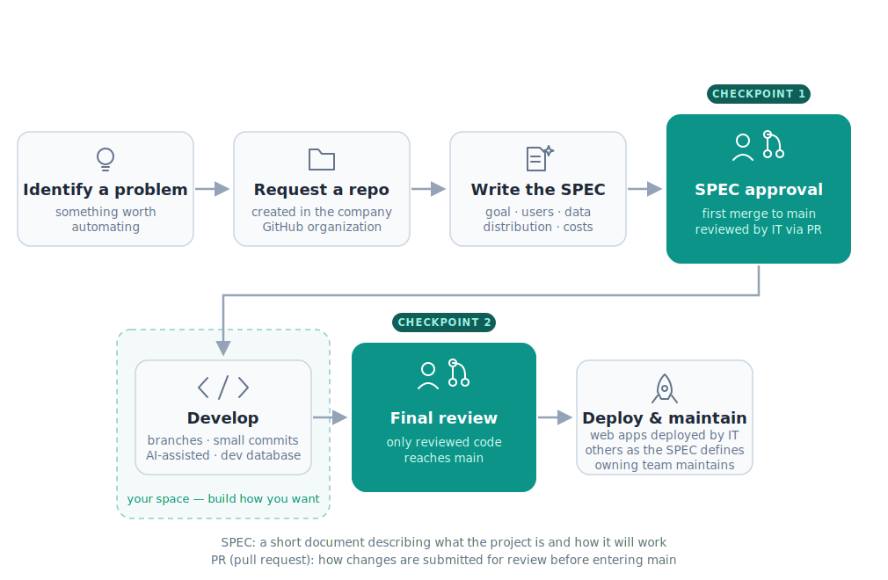
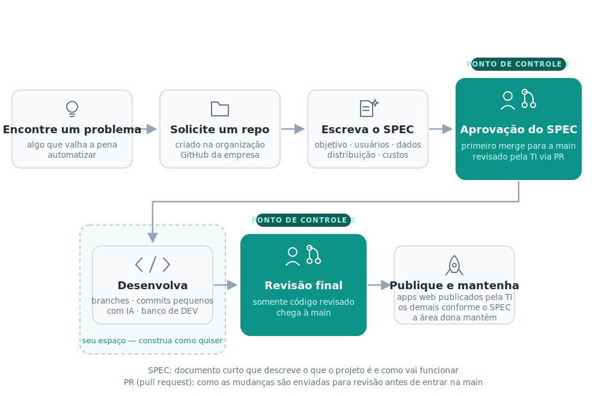
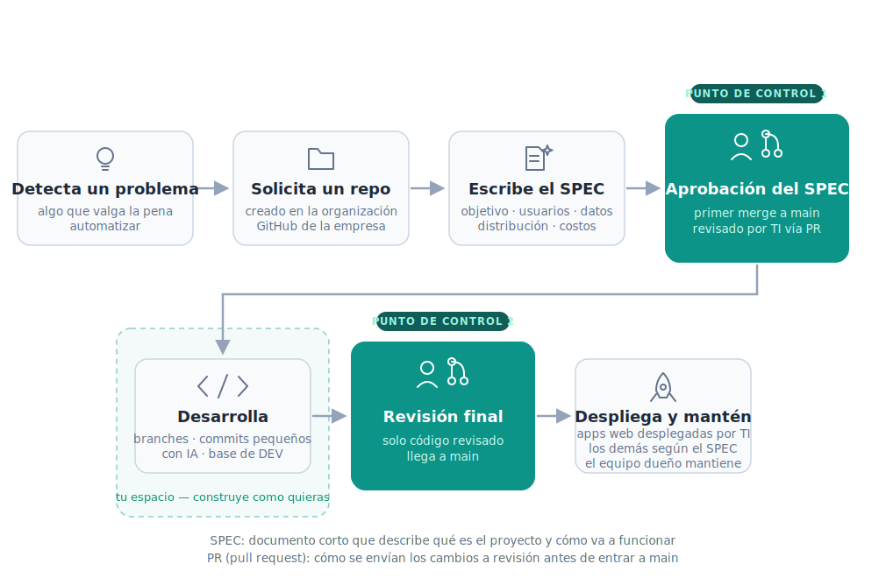

# AGPB AI Development Constitution

**🌐 [English](#english) · [Português (BR)](#português-br) · [Español](#español)**

---

## English

The constitution for AI-assisted development of tools, automations, and applications at AGP Brazil.

**The document: [constitution.md](constitution.md)**

### What this is

A deliberately lean set of rules for building software with AI inside the company. It is **permissive by design**: instead of restricting up front, it defines exactly **two human checkpoints** — the SPEC as the first merge to `main`, and deployment only through reviewed pull requests — and leaves everything in between to the developer.

The rules will evolve based on what people actually build, so expect this document to become more specific over time, not less.

### How to use it

- **If you're building something:** read [constitution.md](constitution.md) before you start. It tells you how to get a repository, what the SPEC gate is, where your data and databases come from, and the recommended stack that covers most use cases.
- **If you're using an AI coding tool:** give it `constitution.md` as context (e.g. reference it from your project's instructions file). The rules are written to be followed by AI agents as well as humans.

### Quick summary

1. Every project gets a repository in the **American-Glass** GitHub organization.
2. The first merge to `main` is the project's **SPEC**, reviewed by IT via pull request.
3. Development happens on branches; everything reaches `main` through PRs.
4. Web apps are deployed by IT via Coolify (Dockerfile required); other projects distribute as defined in their SPEC.
5. Data lives in IT-provided databases and approved sources — no external storage services.

The full rules, including storage, authentication, licensing, security baseline, and the recommended stack, are in [constitution.md](constitution.md).

### Status

This is a living document — some sections are explicitly marked as under construction. Suggestions and change requests are welcome via pull request.

---

## Português (BR)

A constituição para o desenvolvimento assistido por IA de ferramentas, automações e aplicações na AGP Brasil.

**O documento: [constitution.md](constitution.md)** *(em inglês)*

### O que é isto

Um conjunto deliberadamente enxuto de regras para desenvolver software com IA dentro da empresa. É **permissivo por design**: em vez de restringir de antemão, define exatamente **dois pontos de controle humano** — o SPEC como o primeiro merge para a `main`, e o deploy somente através de pull requests revisados — e deixa todo o restante a cargo de quem desenvolve.

As regras vão evoluir com base no que as pessoas realmente constroem; espere que este documento fique mais específico com o tempo, não menos.

### Como usar

- **Se você vai construir algo:** leia o [constitution.md](constitution.md) antes de começar. Ele explica como obter um repositório, o que é o gate do SPEC, de onde vêm seus dados e bancos de dados, e a stack recomendada que cobre a maioria dos casos de uso.
- **Se você usa uma ferramenta de IA para programar:** forneça o `constitution.md` como contexto (por exemplo, referenciando-o no arquivo de instruções do seu projeto). As regras foram escritas para serem seguidas tanto por agentes de IA quanto por humanos.
- **Quer ler a constituição em português?** Peça à sua ferramenta de IA para traduzir ou explicar o documento — o arquivo em inglês é sempre a versão atual.

### Resumo rápido

1. Todo projeto ganha um repositório na organização **American-Glass** do GitHub.
2. O primeiro merge para a `main` é o **SPEC** do projeto, revisado pela TI via pull request.
3. O desenvolvimento acontece em branches; tudo chega à `main` através de PRs.
4. Aplicações web são publicadas pela TI via Coolify (Dockerfile obrigatório); os demais projetos são distribuídos conforme definido no SPEC.
5. Os dados vivem nos bancos fornecidos pela TI e em fontes aprovadas — nada de serviços de armazenamento externos.

As regras completas — armazenamento, autenticação, licenças, baseline de segurança e stack recomendada — estão no [constitution.md](constitution.md).

### Status

Este é um documento vivo — algumas seções estão explicitamente marcadas como em construção. Sugestões e pedidos de mudança são bem-vindos via pull request.

---

## Español

La constitución para el desarrollo asistido por IA de herramientas, automatizaciones y aplicaciones en AGP Brasil.

**El documento: [constitution.md](constitution.md)** *(en inglés)*

### Qué es esto

Un conjunto deliberadamente reducido de reglas para desarrollar software con IA dentro de la empresa. Es **permisivo por diseño**: en lugar de restringir de antemano, define exactamente **dos puntos de control humano** — el SPEC como el primer merge a `main`, y el despliegue únicamente a través de pull requests revisados — y deja todo lo demás en manos de quien desarrolla.

Las reglas evolucionarán según lo que la gente realmente construya; este documento se volverá más específico con el tiempo, no menos.

### Cómo usarlo

- **Si vas a construir algo:** lee [constitution.md](constitution.md) antes de empezar. Explica cómo obtener un repositorio, qué es el gate del SPEC, de dónde vienen tus datos y bases de datos, y el stack recomendado que cubre la mayoría de los casos de uso.
- **Si usas una herramienta de IA para programar:** entrégale `constitution.md` como contexto (por ejemplo, referenciándolo desde el archivo de instrucciones de tu proyecto). Las reglas están escritas para ser seguidas tanto por agentes de IA como por humanos.
- **¿Quieres leer la constitución en español?** Pídele a tu herramienta de IA que traduzca o explique el documento — el archivo en inglés es siempre la versión vigente.

### Resumen rápido

1. Todo proyecto tiene un repositorio en la organización **American-Glass** de GitHub.
2. El primer merge a `main` es el **SPEC** del proyecto, revisado por TI vía pull request.
3. El desarrollo ocurre en branches; todo llega a `main` a través de PRs.
4. Las aplicaciones web las despliega TI vía Coolify (Dockerfile obligatorio); los demás proyectos se distribuyen según lo definido en su SPEC.
5. Los datos viven en las bases de datos provistas por TI y en fuentes aprobadas — nada de servicios de almacenamiento externos.

Las reglas completas — almacenamiento, autenticación, licencias, baseline de seguridad y stack recomendado — están en [constitution.md](constitution.md).

### Estado

Este es un documento vivo — algunas secciones están explícitamente marcadas como en construcción. Sugerencias y solicitudes de cambio son bienvenidas vía pull request.
